# prodev — 과제 비서

## 한 줄로 말하면

공정개발 과제를 하는 사람들이 쓰는 **사내 채팅방에 비서 한 명을 앉혀 놓은 것**이다.
과제를 시작하는 날부터 끝내는 날까지 — 실험 자료 정리 · 조사 · 일정 · 특허 · 논문 · 보고 —
그 비서 하나가 전부 이어 준다.

## 그림으로 말하면

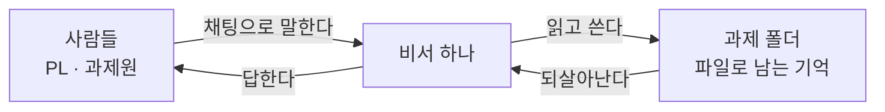

비서는 사람의 말을 듣고, 파일에 적고, 그 파일을 다시 읽어서 기억한다.
**세션이 꺼져도 파일은 남는다.** 그래서 다음 날 켜면 어제 하던 이야기를 이어서 한다.

---

## 이 비서는 어떤 비서인가

신입이 아니라, 과제의 모든 대화 · 파일 · 결정을 다 외우고 있는 비서다.
"그거 얼마였지?" 하고 물으면 이렇게 답한다:

> 92.53% 입니다. (`cards/E-0007.md` · 9월 3일 김과제 님이 올린 `yield.csv` 의 수율_후 열)

이 비서의 성격은 세 가지다.

| 성격 | 무슨 뜻인가 | 왜 이렇게 만들었나 |
|---|---|---|
| **혼자다** | 봇이 하나뿐이다. 봇끼리 대화하지 않는다 | 앞선 실험에서 봇 다섯이 같은 품질에 **15~19배** 비용을 물었다 |
| **스스로 일을 만들지 않는다** | 사람이 시켜야 움직인다. 조사도 허락을 받고 시작한다 | 시키지 않은 일이 쌓이면 사람이 통제를 잃는다 |
| **모르면 모른다고 한다** | 출처 없는 사실은 말하지 않는다 | 사실이 여러 단계를 거치면 조용히 틀어진다 |

> 앞선 실험(`../crew/`)이 남긴 교훈 셋이 이 프로젝트의 뼈대다:
> **검토는 다른 사람이 해야 값을 하고 · 세는 일은 기계가 해야 하고 · 예측을 먼저 적어야 판정이 선다.**

---

## 먼저 낱말 열셋

이 문서와 코드에 계속 나오는 말이다. 여기만 알면 나머지는 읽힌다.

| 낱말 | 쉬운 뜻 |
|---|---|
| **방** | 채팅방. 과제 하나에 방이 딱 **둘**이다 |
| **본방** | `prodev-<과제이름>`. 말은 여기서 다 한다 |
| **files 방** | `prodev-<과제이름>/files`. 파일을 올리는 방 |
| **봉투** | 글 앞에 붙는 `@TO(누구)` · `@CC(누구)` 표시. 누구에게 하는 말인지 알려 준다 |
| **들이기** | 올라온 파일을 읽어서 정리해 넣는 일 (intake) |
| **카드** | 실험 한 건 · 조사 한 건 · 결정 한 건을 적은 파일 하나. `E-0007` 처럼 번호가 붙는다 |
| **확정** | 사람이 "맞다"고 말해 주는 것. 확정 전까지 카드는 임시다 |
| **위키** | 주제별 요약 페이지. 카드들을 모아 "지금 아는 것"을 적는다 |
| **색인** | 무엇이 어디 있는지 적은 목록. 사람이 아니라 **기계가 만든다** |
| **실 (threads)** | 하던 이야기를 적어 둔 메모. 세션이 꺼져도 여기서 이어 간다 |
| **스킬** | 비서가 아는 일하는 방법. "일정 다루는 법", "논문 쓰는 법" 같은 설명서 |
| **도우미** | 오래 걸리는 일을 대신하는 보조 세션 (서브에이전트) |
| **훅 · 관문** | 비서가 말하기 직전에 검사하는 **기계**. 조건이 안 맞으면 말을 못 하게 막는다 |

---

## 무엇을 할 수 있나 — 여덟 가지

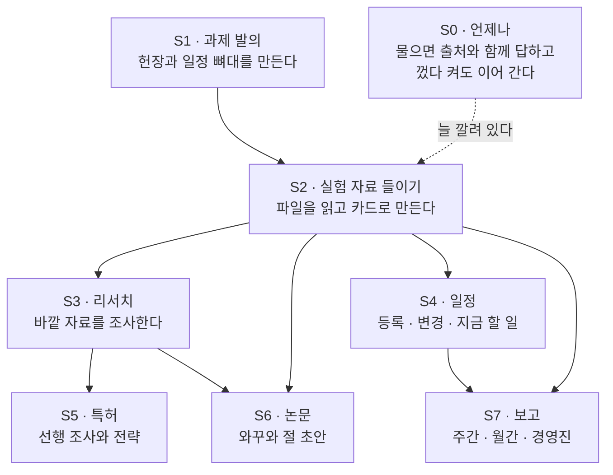

| # | 무엇 | 비서가 하는 일 | **사람이 정하는 곳** |
|---|---|---|---|
| S1 | 과제 발의 | 목적 · 목표 · 일정 · 인원 · 예산 · 판정 기준을 **하나씩** 묻고 헌장 초안을 낸다 | 헌장 결재 (PL) |
| S2 | 자료 들이기 | 파일을 읽고 "이렇게 읽었습니다" 표를 보인 뒤 모르는 것을 **셋 이하로** 묻는다 | 과제원의 "확정" |
| S3 | 리서치 | 우리 자료를 먼저 뒤지고, 없으면 물음을 적어 허락을 구한 뒤 조사한다 | 조사 시작 허락 |
| S4 | 일정 | 등록 · 변경 · "지금 뭐 해야 하지" 브리핑 | 없음 |
| S5 | 특허 | 청구 후보를 뽑고 선행을 조사해 전략을 **셋 이하로** 낸다 | 조사 범위 · 청구 방향 |
| S6 | 논문 | 와꾸(목차)를 짜고 절마다 초안을 쓰며 문장에 근거 카드를 붙인다 | 와꾸 결재 · 절마다 통과 |
| S7 | 보고 | 사람이 준 양식의 칸을 채운다. **숫자마다 출처 카드**를 단다 | 방향 선택 · 발송 결재 (PL) |
| S0 | 언제나 | 껐다 켜도 · 대화가 압축돼도 파일에서 되살아나 "이어서 합니다" 한 줄로 잇는다 | 없음 |

---

## 전체 구조 — 무엇이 어디에 있나

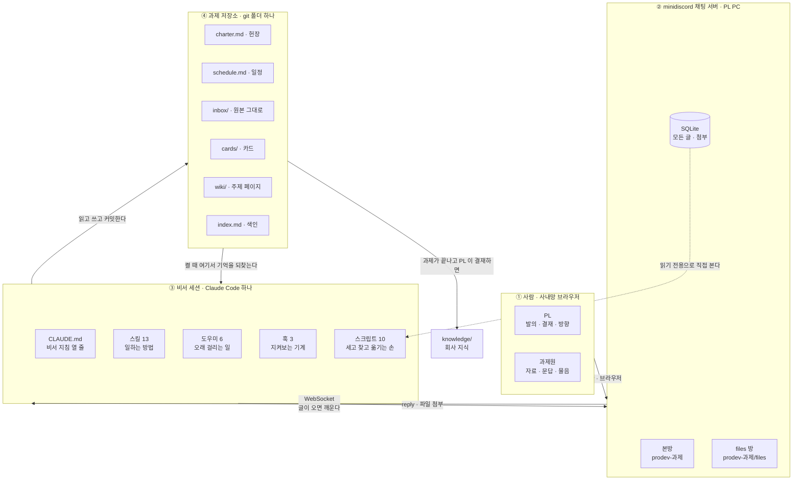

읽는 법은 이렇다.
사람은 **브라우저**로 채팅방에 글을 쓴다. 서버가 그 글을 비서에게 알린다.
비서는 스킬을 보고 어떻게 할지 정하고, **과제 폴더**에 파일로 적는다.
비서의 기억은 머릿속이 아니라 **그 폴더**에 있다. 그래서 세션이 죽어도 잊지 않는다.

### 방은 왜 둘뿐인가

사람이 외울 규칙이 한 줄이면 된다:

> **말은 아무 데서나, 파일은 files 에.**

비서는 **어느 방에서든 답한다.** "그건 저쪽 방에서 물어보세요"라고 하지 않는다.
딱 하나의 예외가 있다. 본방에 파일이 올라오면
"파일은 files 방에 올려주시면 거기서 읽고 여쭙겠습니다" 한 줄만 하고 **읽기 시작하지 않는다.**

---

## 비서는 어떻게 기억하나 — 기억의 다섯 층

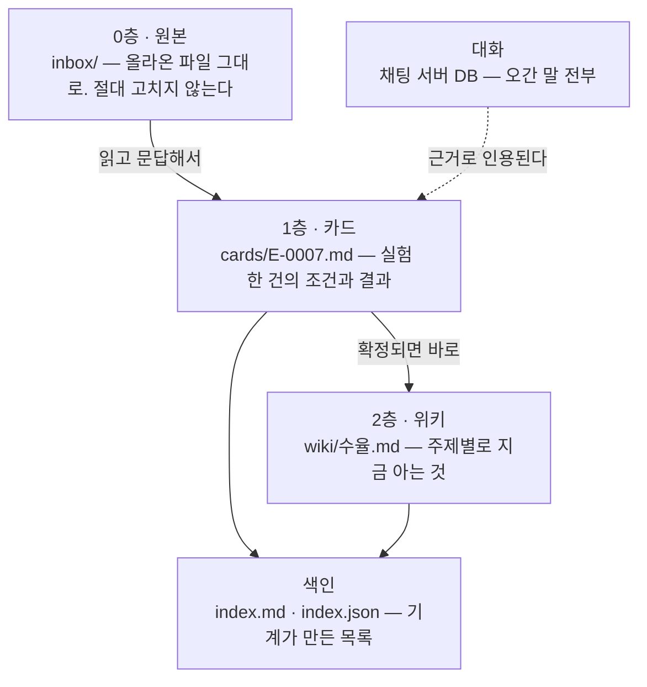

| 층 | 무엇이 들어 있나 | 규칙 |
|---|---|---|
| **0층 원본** | 올라온 파일 그대로 | **절대 고치지 않는다.** 같은 이름이 또 오면 `.v2` 로 옆에 둔다 |
| **1층 카드** | 실험 한 건 = 카드 한 장 | 사람이 "확정"이라고 해야 정식(valid)이 된다 |
| **2층 위키** | 주제별 "지금 아는 것" | **문장마다 카드 번호를 단다.** 번호 없는 문장은 못 쓴다 |
| **색인** | 무엇이 어디 있는지 | 손으로 쓰지 않는다. `index.js` 가 만든다 |
| **대화** | 오간 말 전부 | 지우지 않는다. 언제든 검색된다 |

**아무것도 지우지 않는다.** 틀린 카드는 삭제가 아니라 `void`(무효) 로 바꾸고, 어느 카드가 대신하는지 적어 둔다.

### 기억의 층과 찾기의 층은 다른 것이다

숫자가 달라서 헷갈리기 쉬운데, **둘은 다른 이야기다.**

| | 무엇을 세나 | 몇 개인가 |
|---|---|---|
| **기억의 층** | 비서가 아는 것을 **어디에 쌓아 두나** | 다섯 (원본 · 카드 · 위키 · 색인 · 대화) |
| **찾기의 층** | 물음이 왔을 때 **어느 순서로 뒤지나** | 여섯 (아래 워크플로우 ③) |

가장 눈에 띄는 차이는 **헌장과 일정**이다. 둘은 기억의 층 표에 없다 — 자료에서 지어 올린 것이 아니라 사람이 정해서 적어 둔 **과제 문서**이기 때문이다. 그런데 **찾을 때는 같이 뒤진다** (찾기 4층). "예산이 얼마였지" 는 아주 흔한 물음인데, 한동안 비서가 그 두 파일을 안 보고 있어서 답하지 못했다.

---

## 카드 한 장에는 무엇이 들어가나

카드는 이 비서의 심장이다. 물음의 대부분이 카드에서 풀리고, 안 풀리면 사람이 원본 파일을 열어야 한다. **사람이 원본을 열게 되면 그 카드는 일을 안 한 것이다.**

무엇을 어느 깊이로 담을지는 **두 번 고쳐졌다.** 두 번 다 "카드가 못 답한 물음"이 가르쳐 줬다.

| 판 | 카드가 담은 것 | 그래서 못 답한 물음 |
|---|---|---|
| 1차 | 규격을 **벗어난 것만** | "규격 **이내**인 건 뭐지" |
| 2차 | 갈래별 **수** — "여덟 중 여섯이 이내" | "그 여섯이 **어느 것**이냐" |
| 3차 (지금) | 쫓는 갈래는 **개체까지** | — |

두 번째 고침이 핵심을 짚는다. **요약 표는 수를 주지 개체를 주지 않는다.** "여섯이 이내"까지는 답해도 "그 여섯이 무엇이냐"에는 답하지 못한다.

### 지금 규칙 — 갈래마다 깊이가 다르다

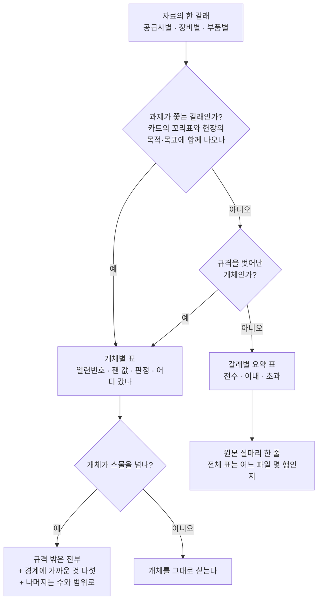

**"과제가 쫓는 갈래"는 비서가 스스로 안다.** 카드의 꼬리표(`tags`)와 헌장의 `## 목적` · `## 목표` 에 **함께** 나오는 것이 그것이다. 사람에게 새로 묻지 않고 파일에서 알 수 있어야 걸음이 늘지 않는다. 그래도 헷갈리면 묻되, **들이기 문답의 물음 셋 안에서** 묻는다 — 물음을 넷째로 늘려 풀면 성적은 올라도 사람이 더 일한 것이다.

**상한이 규칙의 절반이다.** "다 실으면 안전하다"는 틀렸다. 개체가 스물을 넘으면 카드가 못 읽을 만큼 길어지고, **못 읽는 카드는 안 실은 카드와 같다.** 그래서 규격 밖은 전부 · 경계에 가까운 것 다섯 · 나머지는 수와 범위로 줄인다. 한쪽은 너무 적게, 다른 쪽은 너무 많이 — 규칙은 양쪽을 다 막아야 한다.

### 왜 개체까지 내리나 — 실제로 이렇게 드러났다

검수에서 나온 두 자리다. 둘 다 **요약 표만 있었으면 화면에 안 보였을** 것이다.

**하나 — 수는 그대로인데 명단이 바뀐다.**

들이기 문답에서 사람 답 둘이 서로 반대로 움직였다. 중복 판정이 규격 초과를 하나 **줄이고**, 단위 환산이 하나 **늘렸다**. 초과는 **5개에서 5개로 그대로**였다. 그런데 명단에서 하나가 빠지고 하나가 들어왔다.

새로 들어온 것은 **아직 안 쓴 재고**의 샤워헤드였다 — 지금 걸러 낼 수 있는, 조치가 가능한 사실이다. 수만 보면 "변화 없음"이다.

**둘 — 수로는 같은데 분포가 다르다.**

규격 이내 여섯이 공급사별로 셋씩이었다. 요약 표로는 똑같아 보인다. 개체 값을 늘어놓자 갈렸다.

| 공급사 | 잰 값 | 상한 3.0 까지 |
|---|---|---|
| 한쪽 | 2.6 · 2.7 · 2.9 | **붙어 있다** |
| 다른 쪽 | 2.1 · 2.3 · 2.5 | 여유가 있다 |

**상한에 붙어 있다는 것은 다음 로트에서 넘어갈 수 있다는 뜻**이라, 공정에서는 "둘 다 합격"과 전혀 다른 이야기다.

---

## 워크플로우 ① — 말 한마디가 들어오면

비서는 말을 듣자마자 **분기표**부터 본다. 위에서부터 읽어 내려가다 처음 걸리는 줄에서 멈춘다.

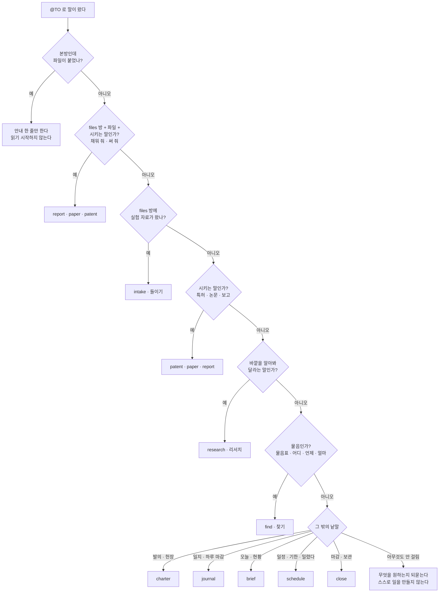

여기서 중요한 순서가 둘 있다.

- **시키는 말이 물음보다 앞이다.** 다만 *시키는 말이 있을 때만*이다. "이 양식에 채워 줘"는 보고지만, "그 숫자 어디서 나왔지"는 찾기다.
- **일지가 브리핑보다 앞이다.** "오늘"이라는 낱말이 둘 다에 들어가기 때문이다.

---

## 워크플로우 ② — 실험 자료 들이기 (가장 자주 도는 흐름)

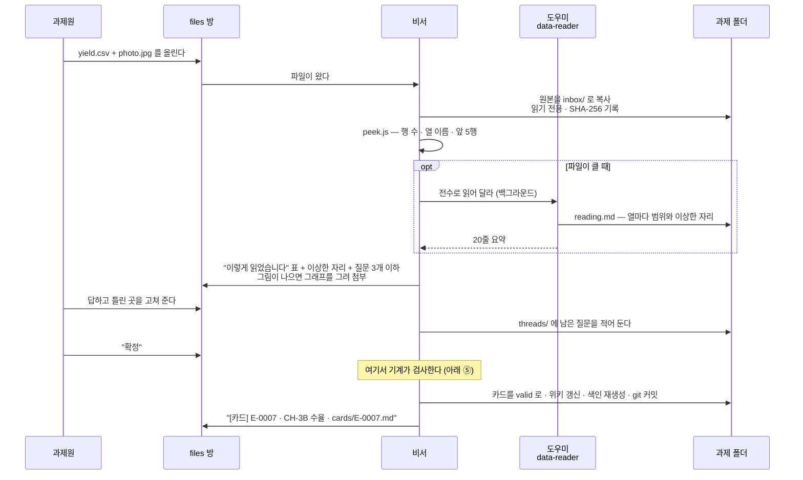

기억할 점 넷:

1. **파일 여럿이 한 실험이면 카드도 하나다.** 파일 수가 아니라 실험 수로 센다.
2. **한 번에 세 개까지만 묻는다.** 질문 폭격을 하지 않는다.
3. **그림으로 물을 수 있으면 그림으로 묻는다.** 사진을 잘라 붙이거나 csv 를 그래프로 그려 올린다.
4. **사람이 "확정"이라고 하기 전에는 카드 공지가 나가지 않는다.** 이건 부탁이 아니라 기계가 막는다.

---

## 워크플로우 ③ — 물어보면 어떻게 찾나

비서는 **아는 척하지 않는다.** 답이 떠올라도 먼저 `find.js` 를 돌린다.
찾는 순서가 코드에 못 박혀 있다.

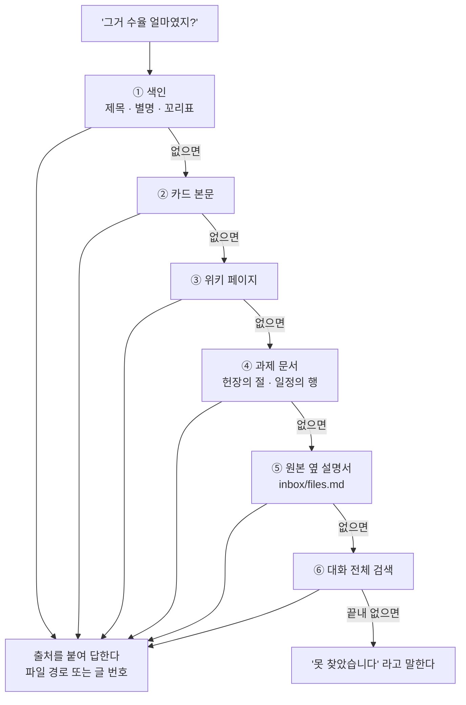

④ 과제 문서는 헌장(`charter.md`)과 일정(`schedule.md`)이다. 예산이나 중간 점검 날짜처럼 사람이 정해서 적어 둔 것이 여기 있다.
**파일을 통째로 뒤지지 않고 절과 행으로 나눠 뒤진다** — 헌장 한 파일에 목적도 예산도 다 들어 있어서, 통째로 맞대면 서로 다른 절의 낱말이 함께 걸려 엉뚱한 답이 나오기 때문이다.

한국어라서 따로 손본 것들이 있다.
**조사를 뗀다**(수율을 → 수율), 띄어쓰기와 하이픈 차이를 무시하고, 무효가 된 카드는 그것을 대신하는 새 카드로 따라간다.
어느 층에서 답이 나왔는지는 `find.log` 에 남는다 — 어느 층이 실제로 읽히는지 재기 위해서다. 층 **번호와 이름을 함께** 적는다. 층이 하나 늘면 번호가 밀려서, 번호만 남긴 옛 기록과 새 기록이 같은 숫자로 다른 층을 가리키게 되기 때문이다.

### 별칭 — 같은 물건을 사람마다 다르게 부른다

1층(색인)이 보는 것은 셋뿐이다. **제목 · 별칭 · 꼬리표.** 그래서 사람이 쓰는 말과 카드 제목이 다르면 **별칭이 1층이 걸리는 유일한 길**이다. 별칭이 비어 있으면 그 카드는 제목을 그대로 말해야만 나온다.

카드를 만들 때 다섯 갈래로 채운다.

| 갈래 | 보기 |
|---|---|
| 정식 부품명 | `SH2200-B-0412` |
| 현장에서 부르는 말 | `샤워헤드` |
| 영문 · 자료의 열 이름 | `showerhead-swap` · `hole_dia_sd` |
| 줄임말 | `SH2200` |
| 흔한 오타 | `샤워해드` |

**아직 못 고친 자리가 여기다.** 검수에서 사람이 `홀 직경 편차` · `규격 넘은` 이라고 물었는데 카드에는 `구멍 지름 산포` · `규격 초과` 로만 적혀 있어 검색이 두 번 빗나갔다. 답은 두 번 다 카드 안에 있었고 비서가 낱말을 바꿔 가며 찾아내 답했지만, 찾는 김에 별칭을 그 자리에서 보태야 했다.

까닭은 이렇다. 지금 별칭은 **자료에 나오는 말**과 **카드가 쓰는 말**로 채워진다. 그런데 사람은 둘 다 아닌 **자기 말**로 묻는다. 들이기 문답에서 사람이 실제로 쓴 낱말을 별칭으로 거두는 것이 가장 싼 길로 보이는데, 아직 규칙이 되지 않았다. **다음 판의 후보다.**

### 재 본 값

세 판에 걸쳐 검수에서 잰 것이다. 물음 열여섯 개를 같은 것으로 놓고 세 번 쟀다.

| 무엇 | 값 |
|---|---|
| **찾기 성공률** | 62.5% (10/16) → 87.5% (14/16) → **100% (16/16)** |
| 검색 한 번 | 약 **23 밀리초** · 결과 **87~172 바이트** |
| 물음 하나당 검색 횟수 | 1.7회 → 2.6회 (별칭이 빗나가 다시 돌린 탓, 위 참고) |
| 카드 한 장 | 약 **10 KB** (171줄) |
| 그 카드가 나온 원본 csv | **2.4 KB** |

**마지막 두 줄을 함께 읽어야 한다. 이 규모에서는 카드가 원본보다 네 배 크다.**

그러니 카드는 **토큰을 아끼려고 만드는 것이 아니다.** 사람이 확정한 사실과, 그 사실이 어디서 왔는지와, 무엇을 아직 모르는지를 담는 장치다. 원본은 무엇이 맞는지 말해 주지 않는다 — 중복인지 별개인지, 단위가 무엇인지, 이 값이 규격 안인지는 사람이 정해 준 것이고 그것이 카드에 있다.

자료가 커지면(수천 행) 그때는 토큰도 아낀다. 하지만 그것은 덤이지 목적이 아니다.

---

## 워크플로우 ④ — 리서치 · 특허 · 논문 · 보고 (오래 걸리는 일)

네 가지가 같은 모양으로 돈다. **사람이 두 번 정하고, 검토가 한 번 끼어든다.**

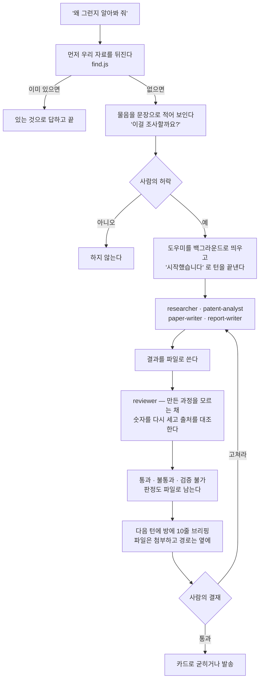

여기 핵심이 둘이다.

- **검토자는 만든 사람의 생각을 물려받지 않는다.** 결과물만 보고 다시 센다. 같은 문맥에서 하는 검토는 값을 하지 않는다는 것이 앞선 실험의 결론이었다.
- **3분 넘는 일은 백그라운드로 넘긴다.** 그래서 조사가 도는 동안에도 다른 사람의 물음에 1분 안에 답할 수 있다.

---

## 워크플로우 ⑤ — 기계가 막는 자리 (훅)

비서가 방에 글을 보내려고 하면, 보내기 **직전에** 기계가 다섯 가지를 본다.
앞에서 걸리면 뒤는 보지 않고, 걸리면 **이유 한 줄**과 함께 되돌려 보낸다. 비서는 그걸 읽고 고쳐서 다시 시도한다.

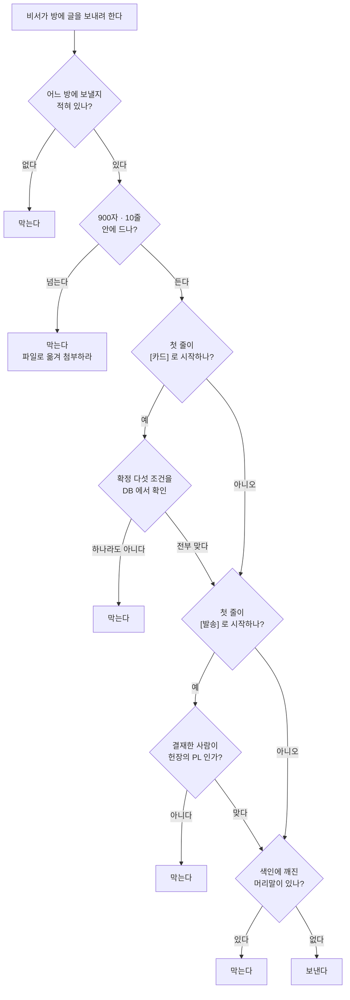

**확정 다섯 조건**은 이렇다. "확정"이라는 말이 진짜인지를 채팅 DB 에서 직접 확인한다.

1. 봇이 아니라 **사람**이 쓴 글일 것
2. 그 과제의 **files 방**에서 온 글일 것
3. 봉투(`@TO(…)`)를 벗긴 본문이 `확정` · `맞다` · `맞습니다` · `그대로` · `OK` 로 시작할 것
4. 파일이 올라온 글들보다 **뒤**에 있고, 바로 앞 봇 글에 같은 카드 번호가 있을 것
5. 카드 상태가 `valid` 일 것

> **방아쇠는 방이 아니라 표식이다.**
> 첫 줄이 `[카드]` 나 `[발송]` 로 시작할 때만 관문이 선다.
> 그래서 비서가 평소 답에서 카드 번호를 입에 올리는 것은 막히지 않는다.

---

## 워크플로우 ⑥ — 껐다 켜도 이어지는 법

비서 세션은 **하루 종일 켜져 있지 않다.** 그런데도 사람은 끊김을 못 느껴야 한다.

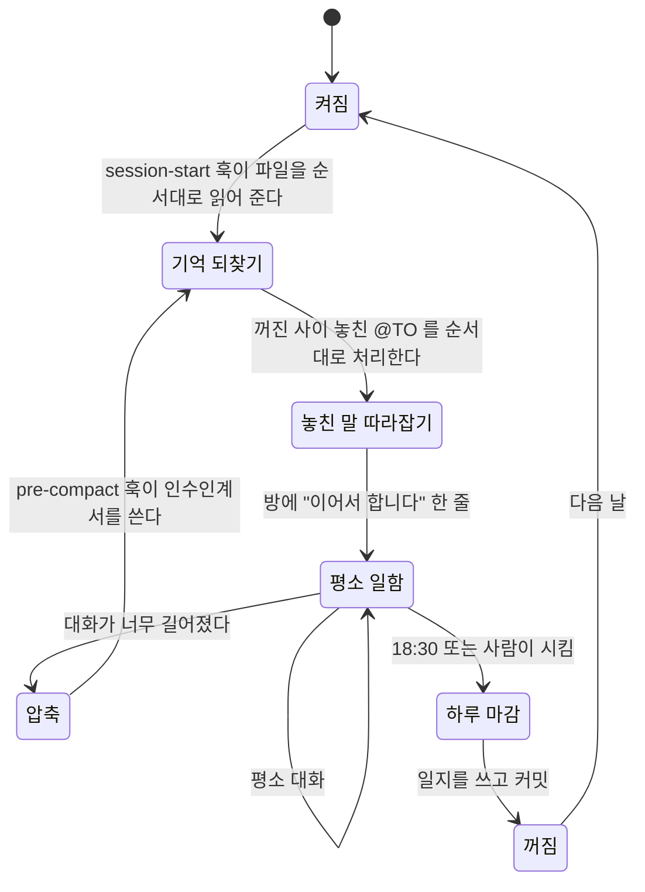

켤 때 읽는 순서가 정해져 있다:
**인수인계서 → 헌장 → 일정 → 열린 실 → 하던 이야기들 → 어제 일지 → 색인 앞 30줄.**

그리고 켜지거나 압축된 뒤 **첫 마디는 언제나 "이어서 합니다" 한 줄**이다.
어느 방에서 무슨 이야기를 하던 중이었는지를 먼저 짚고 시작한다.

---

## 비서의 하루

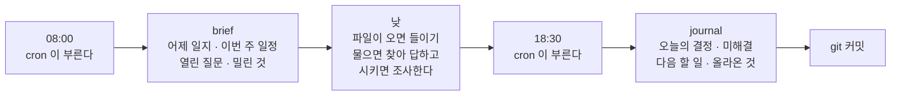

---

## 등장인물

| 누구 | 정체 | 어디 사나 |
|---|---|---|
| **비서** | Claude Code 세션 하나 + 채널 플러그인 | `bots/<봇이름>/` |
| **도우미 여섯** | 오래 걸리는 일을 맡는 보조 세션. 서로 대화하지 않는다 | `.claude/agents/` |
| **알림 계정** | 사람 계정 하나(`prodev-notify`). 훅이 "정리 중" 같은 글을 올릴 때 쓴다 | 채팅 서버 |
| **cron** | PL PC 의 시계. 08:00 브리핑 · 18:30 일지를 부른다 | PL PC |

### 도우미 여섯

| 도우미 | 하는 일 | 돌려주는 것 |
|---|---|---|
| `data-reader` | 큰 파일을 한 줄도 빼지 않고 읽는다 | `reading.md` + 20줄 요약 |
| `researcher` | 문헌 · 규격 · 웹 조사. **출처 없는 문장 금지** | 결론 · 출처 · 못 확인한 것 |
| `reviewer` | 남이 만든 것을 의심하며 다시 센다 | 통과 / 불통과 / 검증 불가 + 이유 3줄 |
| `patent-analyst` | 선행 기술과 청구 후보 | 선행 목록 · 차이 · 위험 |
| `paper-writer` | 논문 절 초안 + 근거 카드 | 경로 · 근거 카드 · 빈 자리 |
| `report-writer` | 보고 양식의 칸 채우기 | 경로 · **출처 없는 숫자 목록** |

공통 규칙 셋: **자세한 건 파일에 · 돌려주는 말은 20줄 안 · 커밋은 하지 않는다.**

### 스킬 열셋

`prodev-orchestrator`(어느 스킬로 갈지 고르는 분기표) 하나와, 일하는 방법 열둘:

`charter` 발의 · `intake` 들이기 · `find` 찾기 · `research` 리서치 · `schedule` 일정 · `brief` 브리핑 ·
`journal` 일지 · `patent` 특허 · `paper` 논문 · `report` 보고 · `review` 검토 · `close` 마감

### 스크립트 열 — 비서의 손

| 스크립트 | 하는 일 |
|---|---|
| `chat.js` | 채팅 DB 를 읽기 전용으로 뒤진다 (검색 · 앞뒤 보기 · 이후 글) |
| `count.js` | 보낼 글이 900자 · 10줄을 넘는지 센다 |
| `index.js` | 카드와 위키를 훑어 색인을 만들고 다음 카드 번호를 준다 |
| `find.js` | 여섯 층을 차례로 뒤진다 |
| `peek.js` | 파일 겉을 본다 (행 수 · 열 이름 · 앞 5행) |
| `intake-copy.js` | 첨부를 `inbox/` 로 들인다 (`.v2` · SHA-256 · 읽기 전용) |
| `plot.py` | csv 한 열을 그래프로 그린다 |
| `setup.js` | 과제 폴더 · 봇 · 설정 · 방 둘을 만든다 |
| `retro-cost.js` | 세션 기록에서 비용과 승인 수를 센다 |
| `replay.js` | 사람 역할을 API 로 재생해 검수한다 |

---

## 지켜야 하는 약속

이 프로젝트에는 숫자로 못 박은 약속이 있다. 느낌이 아니라 **기계가 잰다.**

| 무엇 | 값 |
|---|---|
| 들이기 한 건의 비용 | $3 이하 |
| 들이기 한 건의 문답 왕복 | 중앙값 4회 이하 |
| 찾기 성공률 (카드 · 위키로 답한 비율) | 70% 이상 |
| 사람에게 보내는 글 | 900자 · 10줄 안 |
| 비서 지침(`CLAUDE.md`) 길이 | 40줄 안 |
| 하루 승인 요청 | 3회 이하 |

---

## 돌리는 법

```bash
node scripts/setup.js --project <과제이름>   # 과제 폴더 · 봇 폴더 · 설정을 만든다
node scripts/setup.js rooms <과제이름>       # 방 둘을 열고 봇을 넣는다
npm test                                     # 서버 없이 도는 시험 98건
npm run test:server                          # 임시 채팅 서버를 띄우는 시험 25건
```

`--project` 에는 **이름만** 주면 된다. 폴더를 미리 만들 필요가 없다 —
`MINIDISCORD_BOT_FILES_DIR` 아래에 폴더를 만들고 `git init` 까지 한다.
파일 뿌리 밖에 두고 싶을 때만 경로를 준다.

봇을 실제로 띄우는 순서(cwd · 옵션 조합 · 확인 방법)는 `docs/launch.md` 에 한 자리로 못 박혀 있다.

## 있어야 하는 것

| 무엇 | 판 | 없으면 |
|---|---|---|
| node | ≥ 22 (`node:sqlite` · `node --test`) | 안 돈다 |
| python3 | 3.9+ | `peek.js` 의 xlsx 와 `plot.py` 만 안 된다 |

python 꾸러미는 **있으면 쓰고 없으면 그 부분만 건너뛴다.** 스크립트는 죽지 않고 "못 읽었다: <까닭>" 한 줄을 낸다.

| 꾸러미 · 도구 | 쓰는 곳 | 없을 때 | 들이는 법 |
|---|---|---|---|
| `openpyxl` | `peek.js` 의 xlsx | "못 읽었다: openpyxl 이 없다" | `pip install openpyxl` |
| `matplotlib` | `plot.py` | "못 그렸다: matplotlib 이 없다" | `pip install matplotlib` |
| `pdfplumber` | `peek.js` 의 pdf 글·표 | `pdftotext` 로 넘어간다 | `pip install pdfplumber` |
| `pdftotext` (poppler) | pdfplumber 가 없을 때의 pdf 글 | 쪽 수만 낸다 | `brew install poppler` |

csv · tsv · jpg · png 와 pdf 쪽 수는 node 가 직접 읽는다. 도우미가 하나도 없어도 이것들은 된다.

---

## 문서 읽는 순서

문서는 두 갈래다. **설계는 판(版)마다 얼어붙고, 기록은 계속 자란다.**

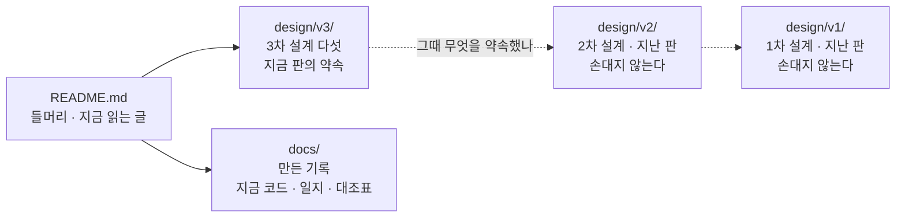

### 설계 — `design/v3/` (지금 판. 지난 판은 `design/v2/` · `design/v1/`, 손대지 않는다)

| 문서 | 무엇 | 언제 읽나 |
|---|---|---|
| `design/v3/PRD.md` | 무엇을 왜 만드나. 시나리오 S0~S7 · 요구 F1~F13 · N1~N7 · 범위 밖 | 처음 |
| `design/v3/ARCHITECTURE.md` | 어떻게 생겼나. 방 둘 · 저장소 둘 · 기억 층 · **찾기 층 여섯** · 흐름 넷 · 훅 셋 | 만들기 전 |
| `design/v3/ADR.md` | 왜 그렇게 정했나. 결정 **서른셋**과 근거 | "왜 이렇게 했지" 싶을 때 |
| `design/v3/TASKS.md` | 누가 언제 무엇을. 단계 다섯 · 관문 넷 + 진화 관문 셋 | 일을 고를 때 |
| `design/v3/VERIFICATION.md` | 어떻게 검수하나. 층 A~D · 단위 시험 · **세션 대 세션 대본** · 예측표 | 관문마다 |

**v2 와 무엇이 다른가** **쓸수록 이 사람에게 맞아 가는 비서**로 간다 (ADR-031~033). v2 에서 찾기는 16/16 으로 닫혔고, v3 이 더하는 것은 **굳은 것이 사는 자리**다 — 규칙은 `house.md`(훅이 여덟째로 싣는다 · 상한 50줄), 분석은 `analysis/`, 양식은 `templates/`. 봇 허용 목록도 41건에서 22건으로 줄였다(내장 `Read`·`Grep`·`Glob` 이 덮는 것을 뺐다).

**v1 과 v2 는 무엇이 달랐나** 검색 안정성 고침이었다 (ADR-026~030). 찾기 층에 과제 문서(헌장 · 일정)를 더해 여섯이 되었고, 카드 `## 결과` 절이 갈래마다 깊이를 다르게 싣게 되었고(과제가 쫓는 갈래는 개체까지, 나머지는 수와 실마리로), 대본 시험이 미니디스코드 없이 세션 대 세션으로 바뀌었다.

판을 어떻게 올리는지는 `design/README.md` 에 있다.

### 기록 — `docs/` (판과 상관없이 계속 갱신한다)

| 문서 | 무엇 | 언제 읽나 |
|---|---|---|
| `docs/as-built.md` | **지금 코드가 어떻게 생겼나.** 부품마다 한 줄 · 훅 · env 전부 · 시험 수 · 설계와 달라진 자리 | 고치기 전 |
| `docs/launch.md` | **봇을 실제로 띄우는 법.** 서버 · 계정 · 설치 · cwd · 옵션 조합 | 띄울 때 |
| `docs/log.md` | **제작 일지.** 단계마다 한 일 · 커밋 범위 · 관문 결과 | 흐름을 알고 싶을 때 |
| `docs/skill-matrix.md` | 스킬 열둘이 설계와 같은지 칸칸이 대조한 표 (72칸) | 스킬을 고칠 때 |
| `docs/harness-input.md` | `/harness:harness` 에 무엇을 주었나 | 스킬·에이전트를 다시 낼 때 |

## 자리

| 자리 | 하는 것 |
|---|---|
| **prodev** (여기) | 만든다. `/harness:harness` 로 스킬·에이전트, 손으로 훅·스크립트·설정 |
| **meta** (`../meta/`) | 예측을 먼저 적고 검수한다. 고칠 때는 관문 사이에만 worktree + PR 로 |
| `../minidiscord/` | 채팅 서버. 여기서 고치지 않는다. 설정 한 줄만 |
| `../crew/` | 앞선 실험. 부품(count.js · 훅 · settings · retro-cost)을 가져온다 |

## 한 줄 규칙 셋

- 세는 것과 막는 것은 기계, 정하는 것은 지침.
- 목표는 밖에(예측 먼저), 결과는 안에.
- 봇에게 판정을 맡기지 않는다.
